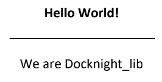
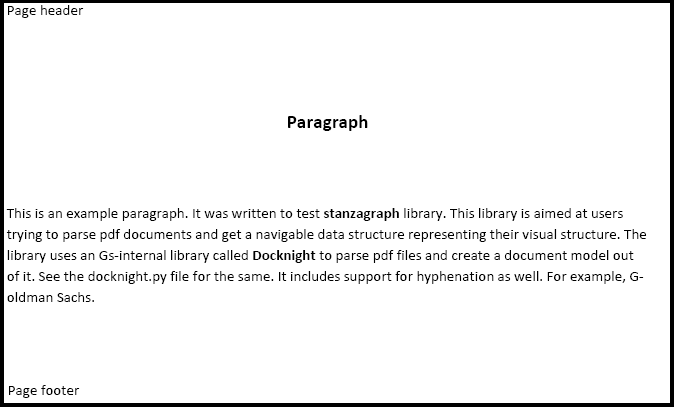
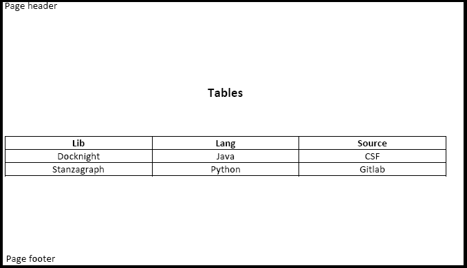

# DocKnight library

`docknight_lib` parses pdf files and generates the _DocModel_ ("visual json") representation, which aims to capture information about the text in the document and its visual appearance, with the goal of supporting knowledge extraction applications. The doc model deconstructs a document into _pages_, _groups_ (a visual paragraph within a page), _lines_, and _segments_ (similarly-styled text within a line).  

## Introduction

Documents are the primary carrier of information in the professional world.  For centuries they have been designed by humans for consumption by humans, and deploy the full range of artistry in visual and textual representation to convey meaning. For instance, a document may contain title pages, running text, displays, tables, charts, may have multiple columns etc. We now need documents understood by code, not just humans; arguably, we need algorithms to recover, represent and exploit visual structure within document. 

This project proposes a tree-structured representation of the information content in a document, _visual json_ (vj), intended to capture all aspects of the visual appearance of a document relevant to understanding the semantic content of the document, and represent it in a programming-language-neutral format (in json). Visual json is intended to be a useful target for extractors operating on pdf, html, xlsx and other document formats. 

While our intial focus is on designign a format that can represent the range of visual information expressed in financial documents (such as company reports, prospectuses, loan documents), we expect that this kind of format would be of use in other technical domains as well. 

## Defninitions
* **style** : A _style_ represents visual characteristics of the text, such as font, style (bold, italic etc.) and size.
* **segment** : A _segment_ consists of a contiguous span of text in the same visual line with the same style. It is the lowest level `Element` in the model.
* **line** : A _line_ represents a visual line in the document. It consists of zero or more segments. A segment boundary marks a change in style information, or large amount of white space.  
* **group** : A _group _is a logical grouping of lines that follow a single reading order. It consists of zero or more lines. A group is used to represent a cluster of lines that a human would understand as constituting a paragraph or a cell in a table.
* **page** : A _page_ represents a visual page in a document, it consists of zero or more groups.

## Structure of output Visual Json
The json at the lowest level contains segment(s), which have following features:
* Style -- underline, bold, italic etc.
* Border - a set of four flags (left, top, bottom, right), telling us if there is a line surrounding text
* Box - a set of four doubles, giving us the bounding box for the text
* Visual span - a set of four doubles specifying a bounding box. Space and surrounding borders are taken into consideration. If the text was part of some tabular region, visual span correspond to the row/col span of that text in the tabular region.
* a unique id
* Font family information
* Font size information
* Text color information

The basic structure of a visual json document is:
```
[document] -> [page]*
[page] -> [group]*            # group is something like a paragraph or table
[group] -> [line]*
[line] -> [segment]*          # segments are visually separable parts of a line (based on spacing or style change)
```

The groups in a page are further classified into _header_, _footer_ and _normal_ groups. The intent is to separate visual information that recurs  stylistically from page to page (e.g. headers and footers) from information that represents the main content of the page.  Information about all the horizontal and vertical graphic lines in the document is also captured in the doc model.
Lines or handwritten areas are actually present at document level as shown in below example. 


#### Example

```
{
  "handWrittenAreas" : [ ],
  "horizontalLines" : [ ],
  "verticalLines" : [ ],
  "pages" : [ {
    "groups" : [ {
      "lines" : [ {
        "segments" : [ {
          "border" : {
            "bottom" : true,
            "left" : false,
            "right" : false,
            "top" : false
          },
          "box" : {
            "bottom" : 46.67999267578125,
            "left" : 422.6199951171875,
            "right" : 546.1959228515625,
            "top" : 39.86249268054962
          },
          "color" : "#000000",
          "fontFamily" : "Times",
          "fontSize" : 12.0,
          "id" : "Content-0_PositionalContent-0",
          "span" : {
            "bottom" : 72.25,
            "left" : 0.0,
            "right" : 792.0,
            "top" : 0.0
          },
          "styles" : [ ],
          "text" : "EXECUTION VERSION"
        } ]
      } ]
    }, {............
```
Example pdf with graphical lines



Visual json for example pdf is as follows:
```
{
  "phrases" : {
    "box" : { ... },
    "handWrittenAreas" : [ ],
    "horizontalLines" : [ [ 216.0, 169.72, 165.0 ] ],
    "pages" : [ {
      "box" : { ...  },
      "groups" : [ {
        "lines" : [ {
          "segments" : [ {
            "border" : { ... },
            "box" : { ... },
            "color" : "#000000",
            "fontFamily" : "Times",
            "fontSize" : 16.0,
            "id" : "0_0",
            "letterSpacing" : -0.03,
            "neighbour" : { ...  },
            "span" : { ... },
            "styles" : [ "bold" ],
            "text" : "Hello World!"
          } ]
        } ]
      }, {
        "lines" : [ {
          "segments" : [ {
            "border" : { ... },
            "box" :  { ... },
            "color" : "#000000",
            "fontFamily" : "Times",
            "fontSize" : 16.0,
            "id" : "2_0",
            "letterSpacing" : 0.0,
            "neighbour" : { ... },
            "span" :  { ... },
            "styles" : [ ],
            "text" : "We are Docknight_lib"
          } ]
        } ]
      } ],
      "scannedness" : 0.0,
      "width" : 595.32
    } ]
  },
  "tables" : {
    "document" : "Document",
    "tables" : [ ]
  }

```
The basic structure of tables in visual json document is:
```
[document] -> [table]*
[table] -> [column]*        # column represent column related information like column headers
[table] -> [row]*           # row represent row related information like indentation level, whether it is header row or not, etc
[table] -> [cell]*          # cell is similar to segment and is a smallest unit in a table
```

## Paragraphs and tables
`DocModel` visual json provides two views of the document, one based on paragraphs, the other on tables. 


### Paragraph view
In this view a document is seen as a collection of pages, which in-turn is a collection of groups, so on. 

Sample PDF



<details><summary>Paragraph Visual Json</summary>
<p>
<pre><code>
{
  "box" : {
    "bottom" : 792.0,
    "left" : 0.0,
    "right" : 612.0,
    "top" : 0.0
  },
  "handWrittenAreas" : [ ],
  "pages" : [ {
    "box" : {
      "bottom" : 792.0,
      "left" : 0.0,
      "right" : 612.0,
      "top" : 0.0
    },
    "groups" : [ {
      "lines" : [ {
        "segments" : [ {
          "border" : {
            "bottom" : false,
            "left" : false,
            "right" : false,
            "top" : false
          },
          "box" : {
            "bottom" : 17.64,
            "left" : 72.02,
            "right" : 127.79,
            "top" : 10.74
          },
          "color" : "#000000",
          "fontFamily" : "Times",
          "fontSize" : 11.0,
          "id" : "0_0",
          "letterSpacing" : 0.0,
          "neighbour" : {
            "bottom" : "1_0",
            "left" : null,
            "right" : null,
            "top" : null
          },
          "span" : {
            "bottom" : 54.42,
            "left" : 0.0,
            "right" : 612.0,
            "top" : 0.0
          },
          "styles" : [ ],
          "text" : "Page header"
        } ]
      } ]
    }, {
      "lines" : [ {
        "segments" : [ {
          "border" : {
            "bottom" : false,
            "left" : false,
            "right" : false,
            "top" : false
          },
          "box" : {
            "bottom" : 99.97,
            "left" : 276.19,
            "right" : 336.04,
            "top" : 91.2
          },
          "color" : "#000000",
          "fontFamily" : "Times",
          "fontSize" : 14.0,
          "id" : "1_0",
          "letterSpacing" : 0.0,
          "neighbour" : {
            "bottom" : "2_0",
            "left" : null,
            "right" : null,
            "top" : "0_0"
          },
          "span" : {
            "bottom" : 129.28,
            "left" : 0.0,
            "right" : 612.0,
            "top" : 54.42
          },
          "styles" : [ "bold" ],
          "text" : "Paragraph"
        } ]
      } ]
    }, {
      "lines" : [ {
        "segments" : [ {
          "border" : {
            "bottom" : false,
            "left" : false,
            "right" : false,
            "top" : false
          },
          "box" : {
            "bottom" : 165.5,
            "left" : 72.02,
            "right" : 300.54,
            "top" : 158.6
          },
          "color" : "#000000",
          "fontFamily" : "Times",
          "fontSize" : 11.0,
          "id" : "2_0",
          "letterSpacing" : 0.0,
          "neighbour" : {
            "bottom" : "3_0",
            "left" : null,
            "right" : "2_1",
            "top" : "1_0"
          },
          "span" : {
            "bottom" : 169.72,
            "left" : 0.0,
            "right" : 301.8,
            "top" : 129.28
          },
          "styles" : [ ],
          "text" : "This is an example paragraph. It was written to test"
        }, {
          "border" : {
            "bottom" : false,
            "left" : false,
            "right" : false,
            "top" : false
          },
          "box" : {
            "bottom" : 165.5,
            "left" : 303.07,
            "right" : 358.75,
            "top" : 158.6
          },
          "color" : "#000000",
          "fontFamily" : "Times",
          "fontSize" : 11.0,
          "id" : "2_1",
          "letterSpacing" : 0.0,
          "neighbour" : {
            "bottom" : "3_0",
            "left" : "2_0",
            "right" : "2_2",
            "top" : "1_0"
          },
          "span" : {
            "bottom" : 169.72,
            "left" : 301.8,
            "right" : 360.01,
            "top" : 129.28
          },
          "styles" : [ "bold" ],
          "text" : "stanzagraph"
        }, {
          "border" : {
            "bottom" : false,
            "left" : false,
            "right" : false,
            "top" : false
          },
          "box" : {
            "bottom" : 165.5,
            "left" : 361.26,
            "right" : 521.78,
            "top" : 158.6
          },
          "color" : "#000000",
          "fontFamily" : "Times",
          "fontSize" : 11.0,
          "id" : "2_2",
          "letterSpacing" : 0.0,
          "neighbour" : {
            "bottom" : "3_0",
            "left" : "2_1",
            "right" : null,
            "top" : "1_0"
          },
          "span" : {
            "bottom" : 169.72,
            "left" : 360.01,
            "right" : 612.0,
            "top" : 129.28
          },
          "styles" : [ ],
          "text" : "library. This library is aimed at users"
        } ]
      }, {
        "segments" : [ {
          "border" : {
            "bottom" : false,
            "left" : false,
            "right" : false,
            "top" : false
          },
          "box" : {
            "bottom" : 180.85,
            "left" : 72.02,
            "right" : 538.93,
            "top" : 173.95
          },
          "color" : "#000000",
          "fontFamily" : "Times",
          "fontSize" : 11.0,
          "id" : "3_0",
          "letterSpacing" : 0.01,
          "neighbour" : {
            "bottom" : "4_0",
            "left" : null,
            "right" : null,
            "top" : "2_0"
          },
          "span" : {
            "bottom" : 185.15,
            "left" : 0.0,
            "right" : 612.0,
            "top" : 169.72
          },
          "styles" : [ ],
          "text" : "trying to parse pdf documents and get a navigable data structure representing their visual structure. The"
        } ]
      }, {
        "segments" : [ {
          "border" : {
            "bottom" : false,
            "left" : false,
            "right" : false,
            "top" : false
          },
          "box" : {
            "bottom" : 196.34,
            "left" : 72.02,
            "right" : 248.66,
            "top" : 189.44
          },
          "color" : "#000000",
          "fontFamily" : "Times",
          "fontSize" : 11.0,
          "id" : "4_0",
          "letterSpacing" : 0.0,
          "neighbour" : {
            "bottom" : "5_0",
            "left" : null,
            "right" : "4_1",
            "top" : "3_0"
          },
          "span" : {
            "bottom" : 200.63,
            "left" : 0.0,
            "right" : 249.87,
            "top" : 185.15
          },
          "styles" : [ ],
          "text" : "library uses an Gs-internal library called"
        }, {
          "border" : {
            "bottom" : false,
            "left" : false,
            "right" : false,
            "top" : false
          },
          "box" : {
            "bottom" : 196.34,
            "left" : 251.08,
            "right" : 297.38,
            "top" : 189.44
          },
          "color" : "#000000",
          "fontFamily" : "Times",
          "fontSize" : 11.0,
          "id" : "4_1",
          "letterSpacing" : 0.0,
          "neighbour" : {
            "bottom" : "5_0",
            "left" : "4_0",
            "right" : "4_2",
            "top" : "3_0"
          },
          "span" : {
            "bottom" : 200.63,
            "left" : 249.87,
            "right" : 298.66,
            "top" : 185.15
          },
          "styles" : [ "bold" ],
          "text" : "Docknight"
        }, {
          "border" : {
            "bottom" : false,
            "left" : false,
            "right" : false,
            "top" : false
          },
          "box" : {
            "bottom" : 196.34,
            "left" : 299.95,
            "right" : 529.42,
            "top" : 189.44
          },
          "color" : "#000000",
          "fontFamily" : "Times",
          "fontSize" : 11.0,
          "id" : "4_2",
          "letterSpacing" : 0.01,
          "neighbour" : {
            "bottom" : "5_0",
            "left" : "4_1",
            "right" : null,
            "top" : "3_0"
          },
          "span" : {
            "bottom" : 200.63,
            "left" : 298.66,
            "right" : 612.0,
            "top" : 185.15
          },
          "styles" : [ ],
          "text" : "to parse pdf files and create a document model out"
        } ]
      }, {
        "segments" : [ {
          "border" : {
            "bottom" : false,
            "left" : false,
            "right" : false,
            "top" : false
          },
          "box" : {
            "bottom" : 211.82,
            "left" : 72.02,
            "right" : 536.65,
            "top" : 204.92
          },
          "color" : "#000000",
          "fontFamily" : "Times",
          "fontSize" : 11.0,
          "id" : "5_0",
          "letterSpacing" : 0.0,
          "neighbour" : {
            "bottom" : "6_0",
            "left" : null,
            "right" : null,
            "top" : "4_0"
          },
          "span" : {
            "bottom" : 216.05,
            "left" : 0.0,
            "right" : 612.0,
            "top" : 200.63
          },
          "styles" : [ ],
          "text" : "of it. See the docknight.py file for the same. It includes support for hyphenation as well. For example, G-"
        } ]
      }, {
        "segments" : [ {
          "border" : {
            "bottom" : false,
            "left" : false,
            "right" : false,
            "top" : false
          },
          "box" : {
            "bottom" : 227.17,
            "left" : 72.02,
            "right" : 136.38,
            "top" : 220.27
          },
          "color" : "#000000",
          "fontFamily" : "Times",
          "fontSize" : 11.0,
          "id" : "6_0",
          "letterSpacing" : 0.0,
          "neighbour" : {
            "bottom" : "7_0",
            "left" : null,
            "right" : null,
            "top" : "5_0"
          },
          "span" : {
            "bottom" : 494.37,
            "left" : 0.0,
            "right" : 612.0,
            "top" : 216.05
          },
          "styles" : [ ],
          "text" : "oldman Sachs."
        } ]
      } ]
    }, {
      "lines" : [ {
        "segments" : [ {
          "border" : {
            "bottom" : false,
            "left" : false,
            "right" : false,
            "top" : false
          },
          "box" : {
            "bottom" : 768.47,
            "left" : 72.02,
            "right" : 124.19,
            "top" : 761.57
          },
          "color" : "#000000",
          "fontFamily" : "Times",
          "fontSize" : 11.0,
          "id" : "7_0",
          "letterSpacing" : 0.0,
          "neighbour" : {
            "bottom" : null,
            "left" : null,
            "right" : null,
            "top" : "6_0"
          },
          "span" : {
            "bottom" : 780.23,
            "left" : 0.0,
            "right" : 612.0,
            "top" : 494.37
          },
          "styles" : [ ],
          "text" : "Page footer"
        } ]
      } ]
    } ],
    "scannedness" : 0.0,
    "width" : 612.0
  } ],
  "version" : "20.10.18"
}
</code></pre>
</p>
</details>

### Tabular view
In this view a document is seen as a collection of tables. 

Sample PDF



<details><summary>Table Visual Json</summary>
<p>
<pre><code>
{
  "document" : "table.",
  "tables" : [ {
    "columns" : [ {
      "index" : 0,
      "path" : "Lib",
      "title" : "Lib"
    }, {
      "index" : 1,
      "path" : "Lang",
      "title" : "Lang"
    }, {
      "index" : 2,
      "path" : "Source",
      "title" : "Source"
    } ],
    "data" : [ {
      "cells" : [ {
        "border" : {
          "bottom" : true,
          "left" : true,
          "right" : true,
          "top" : true
        },
        "box" : {
          "bottom" : 163.46,
          "left" : 143.77,
          "right" : 157.13,
          "top" : 156.56
        },
        "position" : {
          "column" : 0,
          "row" : 0
        },
        "segmentIds" : [ "7_0" ],
        "span" : {
          "columns" : 1,
          "rows" : 1
        },
        "text" : "Lib",
        "textStyles" : [ "bold" ]
      }, {
        "border" : {
          "bottom" : true,
          "left" : true,
          "right" : true,
          "top" : true
        },
        "box" : {
          "bottom" : 163.46,
          "left" : 295.75,
          "right" : 316.94,
          "top" : 156.56
        },
        "position" : {
          "column" : 1,
          "row" : 0
        },
        "segmentIds" : [ "8_0" ],
        "span" : {
          "columns" : 1,
          "rows" : 1
        },
        "text" : "Lang",
        "textStyles" : [ "bold" ]
      }, {
        "border" : {
          "bottom" : true,
          "left" : true,
          "right" : true,
          "top" : true
        },
        "box" : {
          "bottom" : 163.46,
          "left" : 446.5,
          "right" : 477.59,
          "top" : 156.56
        },
        "position" : {
          "column" : 2,
          "row" : 0
        },
        "segmentIds" : [ "9_0" ],
        "span" : {
          "columns" : 1,
          "rows" : 1
        },
        "text" : "Source",
        "textStyles" : [ "bold" ]
      } ]
    }, {
      "cells" : [ {
        "border" : {
          "bottom" : true,
          "left" : true,
          "right" : true,
          "top" : true
        },
        "box" : {
          "bottom" : 177.38,
          "left" : 127.81,
          "right" : 173.02,
          "top" : 170.48
        },
        "position" : {
          "column" : 0,
          "row" : 1
        },
        "segmentIds" : [ "11_0" ],
        "span" : {
          "columns" : 1,
          "rows" : 1
        },
        "text" : "Docknight",
        "textStyles" : [ ]
      }, {
        "border" : {
          "bottom" : true,
          "left" : true,
          "right" : true,
          "top" : true
        },
        "box" : {
          "bottom" : 177.38,
          "left" : 296.95,
          "right" : 316.02,
          "top" : 170.48
        },
        "position" : {
          "column" : 1,
          "row" : 1
        },
        "segmentIds" : [ "12_0" ],
        "span" : {
          "columns" : 1,
          "rows" : 1
        },
        "text" : "Java",
        "textStyles" : [ ]
      }, {
        "border" : {
          "bottom" : true,
          "left" : true,
          "right" : true,
          "top" : true
        },
        "box" : {
          "bottom" : 177.38,
          "left" : 454.05,
          "right" : 470.07,
          "top" : 170.48
        },
        "position" : {
          "column" : 2,
          "row" : 1
        },
        "segmentIds" : [ "13_0" ],
        "span" : {
          "columns" : 1,
          "rows" : 1
        },
        "text" : "CSF",
        "textStyles" : [ ]
      } ]
    }, {
      "cells" : [ {
        "border" : {
          "bottom" : true,
          "left" : true,
          "right" : true,
          "top" : true
        },
        "box" : {
          "bottom" : 191.29,
          "left" : 122.77,
          "right" : 178.01,
          "top" : 184.39
        },
        "position" : {
          "column" : 0,
          "row" : 2
        },
        "segmentIds" : [ "15_0" ],
        "span" : {
          "columns" : 1,
          "rows" : 1
        },
        "text" : "Stanzagraph",
        "textStyles" : [ ]
      }, {
        "border" : {
          "bottom" : true,
          "left" : true,
          "right" : true,
          "top" : true
        },
        "box" : {
          "bottom" : 191.29,
          "left" : 290.58,
          "right" : 322.4,
          "top" : 184.39
        },
        "position" : {
          "column" : 1,
          "row" : 2
        },
        "segmentIds" : [ "16_0" ],
        "span" : {
          "columns" : 1,
          "rows" : 1
        },
        "text" : "Python",
        "textStyles" : [ ]
      }, {
        "border" : {
          "bottom" : true,
          "left" : true,
          "right" : true,
          "top" : true
        },
        "box" : {
          "bottom" : 191.29,
          "left" : 448.66,
          "right" : 475.48,
          "top" : 184.39
        },
        "position" : {
          "column" : 2,
          "row" : 2
        },
        "segmentIds" : [ "17_0" ],
        "span" : {
          "columns" : 1,
          "rows" : 1
        },
        "text" : "Gitlab",
        "textStyles" : [ ]
      } ]
    } ],
    "id" : 0,
    "metadata" : {
      "caption" : "Tables",
      "columnHeaderCount" : 1,
      "columns" : 3,
      "rows" : 3,
      "spanningPages" : [ 0 ]
    },
    "rows" : [ {
      "children" : [ ],
      "headerRow" : true,
      "hierarchyLevel" : 0,
      "immediateParent" : null,
      "index" : 0,
      "parents" : [ ],
      "title" : "Lib",
      "totalRow" : false
    }, {
      "children" : [ ],
      "headerRow" : false,
      "hierarchyLevel" : 0,
      "immediateParent" : null,
      "index" : 1,
      "parents" : [ ],
      "title" : "Docknight",
      "totalRow" : false
    }, {
      "children" : [ ],
      "headerRow" : false,
      "hierarchyLevel" : 0,
      "immediateParent" : null,
      "index" : 2,
      "parents" : [ ],
      "title" : "Stanzagraph",
      "totalRow" : false
    } ]
  } ]
}
</code></pre>
</p>
</details>

## Usage

### Running in IntelliJ

* Open [docKnight](https://github.com/goldmansachs/docknight_lib) in `Intellij`
* Set Java:
```
export JAVA_HOME=/path/to/jdk-1.8.0_121_b13_2
export JDK_HOME=/path/to/jdk-1.8.0_121_b13_2
export IDEA_JDK_64=/path/to/jdk-1.8.0_121_b13_2
```
* Run intellij: `/path/to/GSIntelliJUltimate-prod/bin/idea.sh`
* In intellij to File -> Settings -> Build, Execution, Deployment -> Build Tools -> Maven
* Check these settings:
    * Maven home directory: `/path/to/maven`
    * User settings file: `path/to/maven-settings.xml/inside/the/project`
* Maven can build the project jar in target folder. Run maven using either of below options:
    * In IntelliJ
        * View -> Tool Windows -> Maven Projects
        * Lifecycle -> Clean
        * Lifecycle -> Install
    * In command line
        * sudo apt install maven
        * mvn -B package --file pom.xml
* Open `PhraseExtractor.java` (press shift twice to search)
* Adjust the main method `inputPath` and `outputPath`. `inputPath` is  either a path to single document or path of a directory (in which case all documents in the directory are processed as pdfs, one at a time). `outputPath` is a directory where the visual json will be saved.
* Press the `Play` arrow! 

### Running using command line

```
java -cp path/to/docknight.jar com.gs.ep.docknight.model.extractor.PhraseExtractor <inputPath> <outputPath>

Usage:
  PhraseExtractor [--no-recurse] [--timeout=SEC] [--ignore-overlay] [--tesseract] [--abbyy] [--mixed-layout] [--html] [--min-chars=CNT] [--hand-written] [--page-level-ocr] [--customizations-path=<path>] <input-path> <output-path>

Options:
  -h --help                     Show this screen.
  --no-recurse                  Don't run recursively on the input_path, if it is a directory.
  --timeout=SEC                 Timeout per document in seconds [default: 300].
  --ignore-overlay              Ignore text overlayed on image.
  --tesseract                   Enable tesseract based OCR, if normal processing fails.
  --abbyy                       Enable abbyy based OCR, if normal processing fails.
  --mixed-layout                Process mixed layouts.
  --html                        Generate html as well for debugging.
  --min-chars=CNT               Minimum number of parsed chars document should have [default: 0].
  --hand-written                Detect hand written areas in the document.
  --page-level-ocr              Run ocr if some pages are scanned.
  --customizations-path=<path>  Use customizations on this path in transformers [default: ].
  ```
Customizations-path is the path to json file containing different configurations which is used to parse the document. Sample example of customization json file is as follows:
```
[
  {
    "customization_type": "DISABLE_TABLE_DETECTION",
    "params": [
      "true"
    ]
  }
]
```

Customization_type can be one of the following:
*  TABULAR_NOISE_PATTERNS - used to add pattern that will detect tabular noise elements
*  DISABLE_TABLE_DETECTION - used to disable table detection
*  DISABLE_HEADER_FOOTER_DETECTION - used to disable headers and footer detection
*  POSITIONAL_GROUPING_MAX_DISTANCE_FACTOR - used to set distance factor which is used in group formation
*  MAX_PAGES_ALLOWED - used to set the bound on maximum pages allowed

### Example Queries
```
\\ Retrieve the 2nd page from document
Page page2 = Lists.mutable.ofAll(document.getContainingElements(Page.class)).get(1)

\\ Retrieve all bold text elements from document
MutableList<Element> boldElements = Lists.mutable.ofAll(document.getContainingElements(TextElement.class)).select(element -> (element.getAttribute(TextStyles.class) != null && (element.getAttribute(TextStyles.class).getValue().contains(TextStyles.BOLD))))
```
_vj comment_: Should also release python code for working with visual json.

## Related Work
*  [Amazon Textract](https://aws.amazon.com/textract/)
*  [IBM - Global Table Extractor (GTE)](https://arxiv.org/abs/2005.00589)

## Support 
* Please raise any support request [here](https://gitlab.jira.sdlc.site.gs.com/browse/STAN-151).

